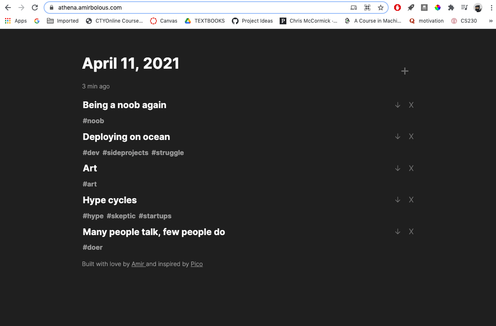

# Athena 📦
A database to dump your thoughts and not forget them. Athena is a simple tool for recording snippets of thought and tagging them by keywords. Instead of being opinionated about how to record data and filled with features, Athena is a simple interface for adding and tagging thoughts. This project is inspired by [Pico]()




This is a personal workflow tool but check the instructions for how to deploy this locally. Will adapt and add features as my workflow changes.


# Deploying
You can run Athena on your local computer simple by cloning the repo, navigating to the main directory, and running
```
go run pkg/athena/server.go
```
and then navigating to localhost:8998. You'll need to install [Go](https://golang.org/doc/install) on your machine to do this.

To deploy this on your own server rig, I'll be posting detailed instructions soon.
